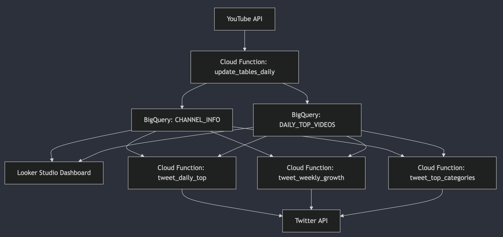
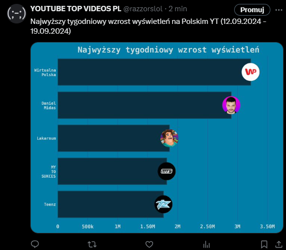
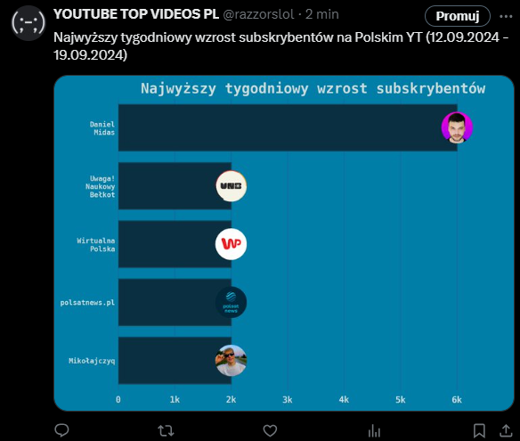
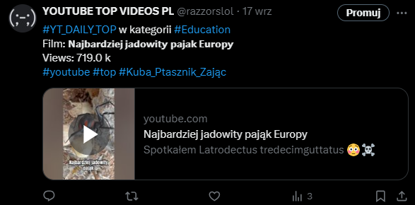

# 📊 YouTube Data Pipeline + 🕊️ Automated Twitter Posting

This project includes a set of Google Cloud Functions that interact with the YouTube Data API and Google BigQuery to analyze YouTube trends. The results are visualized using Looker Studio dashboards and are automatically posted on Twitter.

## Overview

#### The project consists of three Google Cloud Functions:

* **`updating_tables_daily`**: Retrieves daily top YouTube videos, processes the data, stores it in BigQuery, and posts updates on Twitter.
* **`tweet_weekly_growth`**: Calculates the top 5 YouTube creators with the largest growth in the last 7 days and publishes the results as a bar chart and generates a bar chart of the videos with the highest view counts in the last 7 days.


* **`tweet_daily_top`**: Retrieves the daily top videos from YouTube, generates a tweet with the video details, and posts it on Twitter

* **`tweet_top_categories`**: Analyzes and ranks the top YouTube video categories based on performance, creates a bar chart, and shares the results on Twitter.

* These functions collectively provide insights into YouTube trends and performance.

## Twitter Integration

This project is integrated with a Twitter account that automatically posts updates and insights based on the data processed. For more information or to see the latest updates, visit [Twitter account](https://twitter.com/razzorslol).


## Prerequisites
* **Google Cloud Project**: Ensure you have a Google Cloud Project with billing enabled.
* **BigQuery Dataset**: Your project should have the following BigQuery datasets and tables:

<table align="right">
  <tr>
    <th>Table Name</th>
  </tr>
  <tr>
    <td>yt_channel_info</td>
  </tr>
  <tr>
    <td>yt_daily_top_videos</td>
  </tr>
  <tr>
    <td>categories_names</td>
  </tr>
</table>

YouTube Video Categories List you can get from this [link](https://www.jlexart.com/articles/youtube-video-categories-list-78ps).


* **YouTube Data API Access**: Your project needs access to the YouTube Data API v3.
* **Twitter Developer Account**: To enable automated posting, you need Twitter API credentials (API Key, API Key Secret, Access Token, Access Token Secret).
* **Looker Studio Account**: Set up a Looker Studio account to visualize data.
## Setup
#### Detailed setup instructions for each function are included in the respective function's folder. This includes:

* **Configuring Environment Variables**: Environment variable settings are specified in each function's folder.
* **Deploying the Functions**: Deployment commands and steps are provided in each function's folder.
* **Granting Permissions**: Instructions for setting up IAM permissions for Cloud Functions and Cloud Scheduler are in each function's folder.
* **Scheduling the Functions**: Details for setting up Cloud Scheduler jobs are included in each function's folder.

## Automated Twitter Posting

#### The youtube_data_pipeline function includes automated posting on Twitter. After retrieving and processing YouTube data:

* **Twitter API Integration**: The function uses the Twitter API to post updates about the daily top YouTube videos. Ensure your Twitter API credentials are set up correctly in the environment variables.
* **Posting Updates**: The function formats the data into a tweetable format and posts it to your Twitter account, keeping your followers updated with the latest trends.

## Looker Studio Dashboard

#### Integrate the data with Looker Studio to create visualizations:

* **Create Data Sources**: Connect your BigQuery tables (`yt_channel_info`, `yt_daily_top_videos`) as data sources in Looker Studio.
* **Create Dashboards**:
  <ul>
    <li><strong>Daily Top Videos:</strong> Visualize daily top videos and their metrics.</li>
    <li><strong>Top Creators Growth:</strong> Display a bar chart of the top 5 channels with the highest growth in the last 7 days.</li>
    <li><strong>Top Videos by Views:</strong> Show a bar chart of videos with the highest view counts in the last 7 days.</li>
  </ul>

## Usage
* #### Each function is scheduled to run automatically according to the defined schedule. Ensure all environment variables and API configurations are correctly set up as detailed in each function's folder.

## Troubleshooting

#### Function Logs: View logs in Google Cloud Console to diagnose issues:
```bash
gcloud functions logs read updating_tables_daily --region=YOUR_REGION
gcloud functions logs read tweet_weekly_growth --region=YOUR_REGION
gcloud functions logs read tweet_daily_top --region=YOUR_REGION
gcloud functions logs read tweet_top_categories --region=YOUR_REGION
```
* #### Permissions Issues: Verify that all necessary IAM permissions are granted.
* #### Looker Studio Issues: Check data source connections and visualization settings if issues arise with dashboards.
* #### Twitter Posting Issues: Ensure your Twitter API credentials are correct and that the function has appropriate permissions to post tweets.
